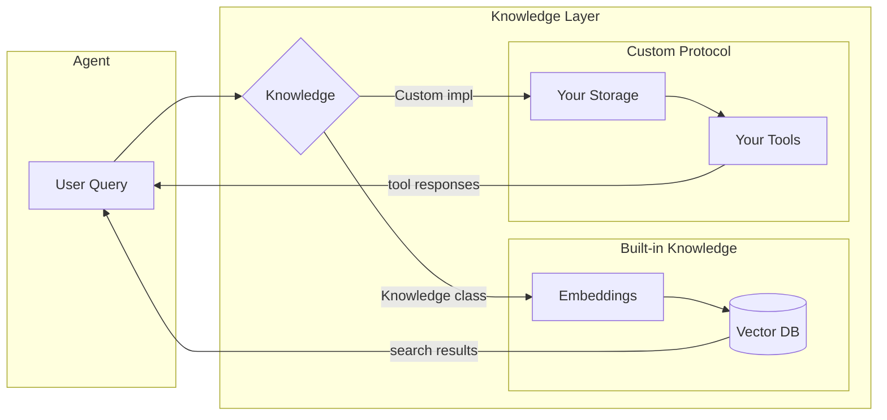
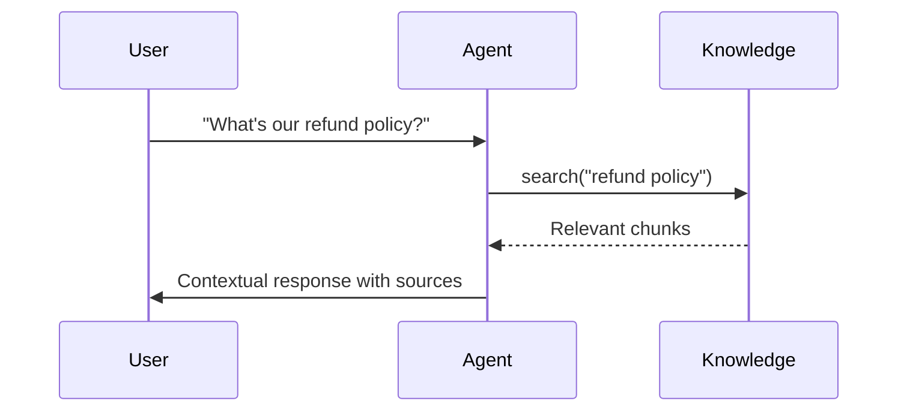

Knowledge gives your agents access to domain-specific information at runtime. Agno provides a complete RAG pipeline out of the box, and also supports custom implementations for when you need your own storage layer.

## Architecture Overview



**Built-in Knowledge** uses vector embeddings and semantic search. Your documents are chunked, embedded, and stored in a vector database. The agent searches by meaning, not keywords.

**Custom Protocol** lets you bring your own storage layer. Define what tools your agent has access to and how retrieval works.

## How Retrieval Works

When your agent receives a question:



1. The agent analyzes the question and decides to search
2. The query is embedded and compared against stored vectors
3. The most similar chunks are retrieved
4. The agent synthesizes an answer from the retrieved context

## Retrieval Modes

| Mode | How it works | Best for |
|------|--------------|----------|
| **Agentic RAG** | Agent decides when to search | Dynamic conversations, complex queries |
| **Traditional RAG** | Knowledge always added to context | Predictable behavior, simple Q&A |

```python
# Agentic RAG - agent decides when to search
agent = Agent(
    knowledge=knowledge,
    search_knowledge=True
)

# Traditional RAG - always includes knowledge
agent = Agent(
    knowledge=knowledge,
    add_knowledge_to_context=True
)
```

## Vector Embeddings

Embeddings capture meaning as numbers. "Refund policy" and "return procedures" end up close in vector space even though they don't share exact words. This enables semantic search beyond keyword matching.

## Next Steps

<CardGroup cols={2}>
  <Card title="Getting Started" icon="rocket" href="/basics/knowledge/getting-started">
    Build your first knowledge-powered agent
  </Card>
  <Card title="Custom Knowledge" icon="wrench" href="/basics/knowledge/concepts/knowledge-protocol/overview">
    Implement your own storage layer
  </Card>
  <Card title="Chunking Strategies" icon="scissors" href="/basics/knowledge/concepts/chunkers/overview">
    Optimize how content is broken down
  </Card>
  <Card title="Vector Databases" icon="database" href="/basics/vectordb/overview">
    Choose the right storage solution
  </Card>
</CardGroup>
