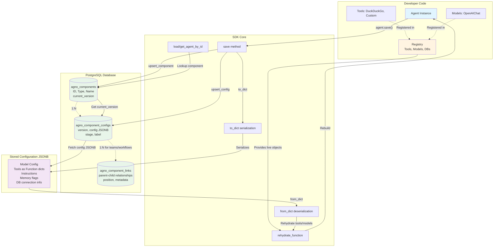

Agno Agent Builder SDK is a system for building, saving, and managing AI agents with a database-backed architecture.
Think of it like a version control system for AI agents. Instead of losing your agent configurations when your program closes, Agno saves everything to a PostgreSQL database so you can reload agents later with all their settings intact.

## How It Works:
The system uses three database tables working together:

1. **Components Table** - Stores basic information about each agent, team, or workflow (like a contact card with a name and type)
2. **Configs Table** - Stores actual settings for each version (instructions, model choice, parameters)
3. **Links Table** - Tracks relationships between components (which agents belong to which teams)

## Architecture

## The Challenge
AI agents use functions and tools (like web search or calculators) that can't be saved as text in a database. The SDK solves this with a **Registry** - a lookup table that holds references to all live tools and models. When loading an agent, the Registry reconnects the saved configuration to the actual working code.

## Key Features

- **Version Control**: Every save creates a new immutable version
- **Reusability**: Load saved agents across different sessions
- **Composability**: Build teams and workflows from individual agents
- **Persistence**: All configurations survive restarts

The SDK handles serialization (converting agents to saveable format) and deserialization (rebuilding agents from saved data) automatically through `save()` and `load()` methods.
