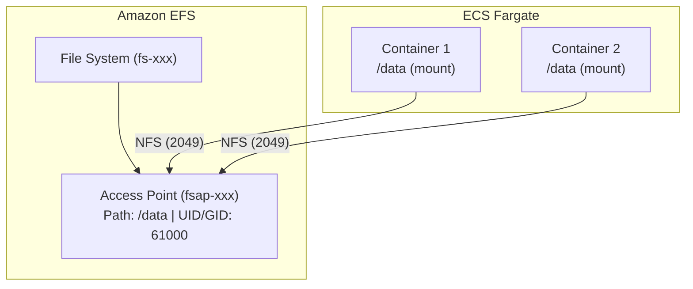

Amazon Elastic File System (EFS) provides shared, persistent storage for your ECS containers. Use it when your agents need data to survive container restarts or deployments.

## When to Use EFS

<AccordionGroup>
  <Accordion title="Your agents store local data">
    Agents like Pal use DuckDB to store structured data locally. Without EFS, this data is lost when containers restart.
  </Accordion>
  <Accordion title="You need data to survive deployments">
    Each `ag infra up` creates new containers. EFS ensures your data persists across deployments.
  </Accordion>
  <Accordion title="Multiple containers need shared access">
    If you scale to multiple ECS tasks, EFS provides a shared filesystem all containers can access.
  </Accordion>
</AccordionGroup>

## Pal Agent Requirements

<Warning>
**Pal agent requires EFS in production.** Without EFS, Pal's DuckDB data (notes, bookmarks, research) is lost when containers restart or redeploy.
</Warning>

| Agent | EFS Required? | Why |
|-------|---------------|-----|
| Pal | Yes | Stores DuckDB at `/data/pal.db` |
| Knowledge Agent | No | Uses PostgreSQL (RDS) |
| MCP Agent | No | Stateless |

### DuckDB Single Worker Requirement

<Warning>
DuckDB requires single-writer access. The template sets `--workers 1` in the uvicorn command. Do not increase workers if using Pal or any DuckDB-based agent.
</Warning>

Multiple workers cause "database is locked" errors and potential data corruption.

## Data Persistence Summary

| Data Type | Storage | Survives Restart? |
|-----------|---------|-------------------|
| Agent memory & sessions | PostgreSQL (RDS) | ✓ Yes |
| Knowledge embeddings | PostgreSQL (RDS) | ✓ Yes |
| Pal's DuckDB (notes, bookmarks) | Local `/data` | ✗ No (needs EFS) |
| File uploads | Local filesystem | ✗ No (needs EFS or S3) |

## Architecture



## Setup Guide

<Steps>

<Step title="Create an EFS File System">

Create a new file system in your AWS region:

```bash
aws efs create-file-system \
  --creation-token agentos-efs \
  --performance-mode generalPurpose \
  --throughput-mode bursting \
  --region us-east-1
```

Save the `FileSystemId` from the response (e.g., `fs-0123456789abcdef0`).

<Tip>
Use `generalPurpose` performance mode for most workloads. Only use `maxIO` for highly parallelized applications.
</Tip>

</Step>

<Step title="Create an Access Point">

Access points provide application-specific entry points with user/permission mapping:

```bash
aws efs create-access-point \
  --file-system-id fs-0123456789abcdef0 \
  --posix-user Uid=61000,Gid=61000 \
  --root-directory "Path=/data,CreationInfo={OwnerUid=61000,OwnerGid=61000,Permissions=755}" \
  --region us-east-1
```

Save the `AccessPointId` from the response (e.g., `fsap-0123456789abcdef0`).

<Note>
The UID/GID `61000` matches the non-root user in the AgentOS container. This ensures your application can read and write to EFS.
</Note>

</Step>

<Step title="Configure Infrastructure Settings">

Update `infra/settings.py` with your EFS IDs:

```python infra/settings.py
infra_settings = InfraSettings(
    ...
    # EFS for persistent storage
    efs_file_system_id="fs-0123456789abcdef0",
    efs_access_point_id="fsap-0123456789abcdef0",
)
```

</Step>

<Step title="Create Mount Targets">

EFS needs mount targets in each subnet your ECS tasks use. First, deploy to create the EFS security group:

```bash
ag infra up prd:aws
```

Then get the security group ID:

```bash
aws ec2 describe-security-groups \
  --filters "Name=group-name,Values=*-efs-sg" \
  --query 'SecurityGroups[0].GroupId' \
  --output text
```

Create mount targets in each subnet:

```bash
# Replace with your subnet IDs and security group
aws efs create-mount-target \
  --file-system-id fs-0123456789abcdef0 \
  --subnet-id subnet-0abc123def456789a \
  --security-groups sg-0123456789abcdef0

aws efs create-mount-target \
  --file-system-id fs-0123456789abcdef0 \
  --subnet-id subnet-0def456789abc123b \
  --security-groups sg-0123456789abcdef0
```

</Step>

<Step title="Verify and Redeploy">

Redeploy to pick up the EFS configuration:

```bash
ag infra up prd:aws -y
```

Verify the mount by checking your container logs:

```bash
aws logs tail /ecs/{infra_name}-prd --follow
```

You should see your application start without errors. Data written to `/data` now persists across restarts.

</Step>

</Steps>

## Settings Reference

| Setting | Type | Description |
|---------|------|-------------|
| `efs_file_system_id` | `str` | EFS file system ID (e.g., `fs-0123456789abcdef0`) |
| `efs_access_point_id` | `str` | Access point ID (e.g., `fsap-0123456789abcdef0`). Optional but recommended for permission mapping. |

## How It Works

When you configure EFS settings, the infrastructure automatically:

1. **Creates a security group** (`*-efs-sg`) allowing NFS traffic (port 2049) from your app containers
2. **Configures an ECS volume** with transit encryption enabled
3. **Mounts the volume** at `/data` in your container

The relevant code in `prd_resources.py`:

```python
# EFS Volume configuration
prd_efs_volume = EcsVolume(
    name="efs-data-volume",
    efs_volume_configuration={
        "fileSystemId": efs_file_system_id,
        "transitEncryption": "ENABLED",
        "authorizationConfig": {
            "accessPointId": efs_access_point_id,
            "iam": "DISABLED",
        },
    },
)

# Mount point in FastApi app
prd_fastapi = FastApi(
    ...
    ecs_volumes=[prd_efs_volume],
    ecs_container_mount_points=[
        {"sourceVolume": "efs-data-volume", "containerPath": "/data"}
    ],
)
```

## Cost

EFS pricing is based on storage used:

| Storage Class | Price (US East) |
|---------------|-----------------|
| Standard | $0.30/GB-month |
| Infrequent Access | $0.016/GB-month |
| Archive | $0.008/GB-month |

**Example costs:**
- 1 GB of agent data: ~$0.30/month
- 10 GB of documents: ~$3.00/month

There's no minimum fee. You only pay for what you use.

<Tip>
Enable lifecycle policies to automatically move infrequently accessed files to cheaper storage classes.
</Tip>

## Troubleshooting

<AccordionGroup>
  <Accordion title="Mount target not found">
    Ensure you've created mount targets in the same subnets specified in `infra/settings.py`. Each subnet needs its own mount target.

    ```bash
    aws efs describe-mount-targets --file-system-id fs-xxx
    ```
  </Accordion>

  <Accordion title="Permission denied errors">
    Check that your access point uses UID/GID `61000` to match the container user. Verify with:

    ```bash
    aws efs describe-access-points --access-point-id fsap-xxx
    ```
  </Accordion>

  <Accordion title="ECS task fails to start">
    Check that the EFS security group allows inbound NFS (port 2049) from your app security group:

    ```bash
    aws ec2 describe-security-groups --group-names "*-efs-sg"
    ```
  </Accordion>

  <Accordion title="Data not persisting">
    Ensure your application writes to `/data`, not another directory. Check your `DATA_DIR` environment variable.
  </Accordion>
</AccordionGroup>

## Next Steps

<CardGroup cols={3}>
  <Card title="Verify" icon="check" href="/production/aws/after-deploy/verify">
    Confirm deployment works
  </Card>
  <Card title="HTTPS" icon="lock" href="/production/aws/after-deploy/https">
    Add SSL certificate
  </Card>
  <Card title="Monitoring" icon="chart-line" href="/production/aws/manage/monitoring">
    CloudWatch logs
  </Card>
</CardGroup>
